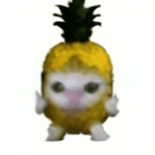
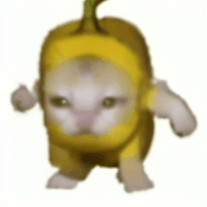
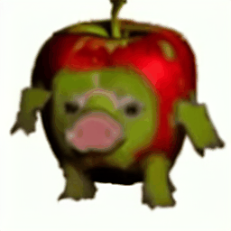

# 🎬 Text-to-Meme-Star

**Text-to-Meme-Star** is a lightweight text-to-video generation model that creates short animated gifs (meme or emoji-style) from natural language prompts. It's optimized for low-latency applications like **chat apps**, where users want a fast, expressive animation generated on the fly from a few words.

> ✨ Example: Input — “dancing xxx” → Output — 🤯 animated gif of an dancing cat/dog cartoon.

---

## 🧠 Core Features

- ⚡ **Fast Inference** on 8GB GPUs (stable-diffusion backbone + motion module)
- 🐥 **Lightweight Model** (based on stable-diffusion-v1-5 + AnimateDiff-style motion)
- 🧪 **Trained on one (text, video) pair** for fine-tuned personalization
- 🎭 **Emoji/Meme Style Control** 
- 🔁 **Short GIF Output** (1–2 seconds, 128×128 or 256×256)
- 🧾 **Prompt-based Generation** for expressive messaging UX

---
## 📊 Results

| **Training Pair** | **Test Prompt 1** | **Test Prompt 2** | **Test Prompt 3** |
|-------------------|-------------------|-------------------|-------------------|
| <br>`"apple-cat"` | <br>`"running pineapple-cat"` | <br>`"running banana-cat"` | <br>`"running green apple-pig"` |
| <br>`"popping cat"` | <br>`"popping cow"` | <br>`"popping rabbit"` | <br>`"popping pig"` | <br>`"Basenji dog"` |

> Each row shows a training (text, video) pair, followed by test results from unseen prompts.

---

## 🛠️ Model Architecture

- **Backbone**: [Tiny-Stable-Diffusion](https://github.com/lambdal/Tiny-Stable-Diffusion)
- **Temporal Layer**: Custom 2D → 3D motion blocks or AnimateDiff-style add-ons
- **Training Framework**: Modified [Tune-A-Video](https://github.com/showlab/Tune-A-Video)
- **Input**: Short sentence or phrase (`"running pineapple-cat"`, `"dancing cat"`)
- **Output**: Animated video (gif or mp4, 16–24 frames)

---

## 📦 Installation

```bash
git clone https://github.com/yourusername/text-to-meme-star.git
cd text-to-meme-star
conda create -n meme-star python=3.9
conda activate meme-star
pip install -r requirements.txt
